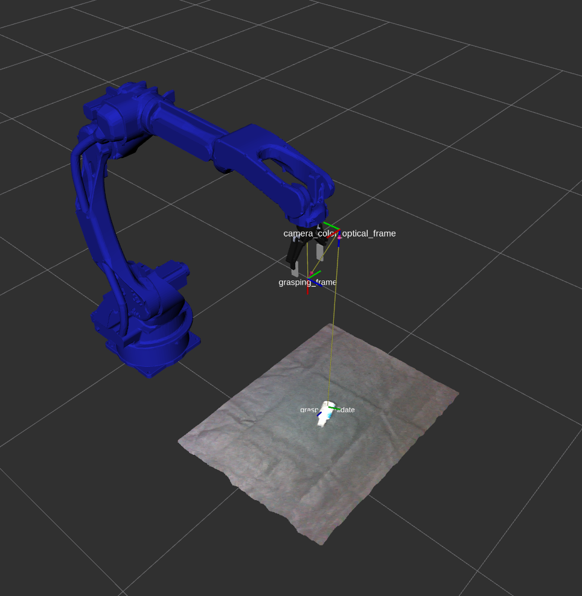
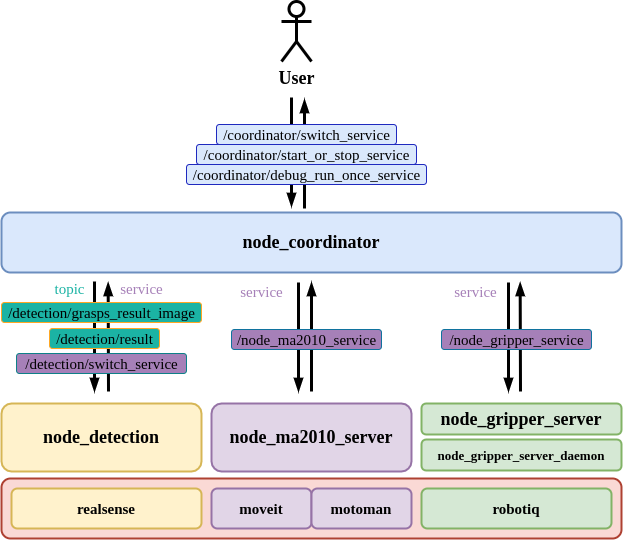
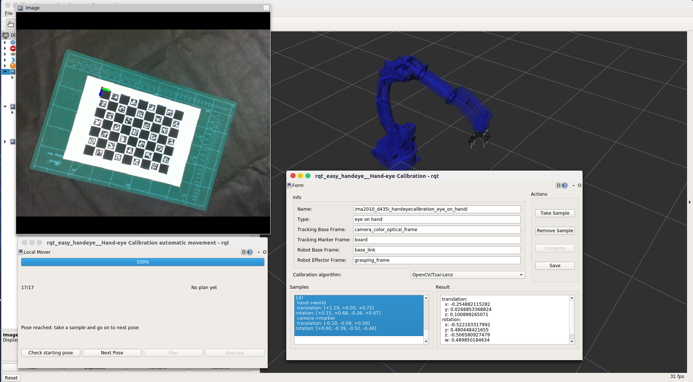

# 安川MA2010机械臂 + Robotiq 2F-140夹爪视觉抓取 (持续更新...)
**功能：在ROS平台上，使用realsense相机引导安川MA2010机械臂用Robotiq 2F-140夹爪进行抓取**

**目录**

- [安川MA2010机械臂 + Robotiq 2F-140夹爪视觉抓取 (持续更新...)](#安川ma2010机械臂--robotiq-2f-140夹爪视觉抓取-持续更新)
  
  - [环境](#环境)
  - [安装](#安装)
    - [前置条件](#前置条件)
    - [安川机械臂驱动和夹爪驱动](#安川机械臂驱动和夹爪驱动)
    - [安装本仓库](#安装本仓库)
  - [安川驱动测试](#安川驱动测试)
    - [官方的功能包测试](#官方的功能包测试)
    - [用带有robotiq夹爪的机械臂测试](#用带有robotiq夹爪的机械臂测试)
  - [节点关系图](#节点关系图)
    - [Robotiq夹爪功能测试](#Robotiq夹爪功能测试)
    - [MA2010 Server功能](#MA2010-Server功能)
    - [Coordinator功能](#Coordinator功能)
  
  - [眼在手上标定](#眼在手上标定)
  - [致谢](#致谢)

---




## 环境

**系统：Ubuntu16.04 + ROS kinetic**

**语言：Python3.7 + CPP**


## 安装

### 前置条件
  1. 安装[ROS](https://wiki.ros.org/kinetic/Installation/Ubuntu)

     ```bash
     # 包括ros-controller
     sudo apt-get install ros-kinetic-ros-control
     sudo apt-get install ros-kinetic-ros-controller
     sudo apt-get install ros-kinetic-moveit
     ```

2. 安装[realsense-ros](https://github.com/IntelRealSense/realsense-ros)

   * realsense2_camera（相机发布图像话题）
   * realsense2-description（包含相机urdf模型）


### 安川机械臂驱动和夹爪驱动
1. 安川机械臂机械臂驱动使用[ros-industrial/motoman](https://github.com/ros-industrial/motoman)，本仓库删除了一些无关的内容，仅保留ma2010_support；
2. Robotiq 2F-140使用[Danfoa/robotiq_2finger_grippers](https://github.com/Danfoa/robotiq_2finger_grippers)的代码进行驱动，对某些部分进行修改并集成在本仓库中。


### 安装本仓库
1. 创建工作空间
    ```bash
    mkdir -p demo_ws/src
    cd demo/src
    catkin_init_workspace
2. 将项目clone下来
   ```bash
   git clone --recursive https://github.com/ryanreadbooks/motoman_robotiq_grasping.git
3. 相关依赖的安装
    ```bash
    cd ..
    rosdep install --from-paths src --ignore-src -y -r
4. 使用catkin build编译
    ```bash
    # 由于项目使用python3,所以需要指定python3路径进行编译，向下面这样，如果你是其它路径，则替换下面三个路径
    catkin config -DPYTHON_EXECUTABLE=/home/ryan/Apps/miniconda3/bin/python -DPYTHON_INCLUDE_DIR=/home/ryan/Apps/miniconda3/include/python3.7m -DPYTHON_LIBRARY=/home/ryan/Apps/miniconda3/lib/libpython3.7m.so
    # 指定不进行安装
    catkin config --no-install 
    # 用catkin build进行编译
    catkin build -DSETUPTOOLS_DEB_LAYOUT=OFF    
    # 激活
    source devel/setup.bash
    ```


## 安川驱动测试

**确保电脑已经通过网线连接上机械臂控制柜内的网口**

* 确保电脑的ip和机械臂控制柜的ip是在同一个局域网网段内；
* 用 ping 命令确保两者连接正常。

### 官方的功能包测试
`ros-industrial/motoman`的ma2010测试按照[官方的wiki](http://wiki.ros.org/motoman_driver/Tutorials/Usage)进行。需要先将`robot_description`和`controller_joint_names`载入参数服务器（[官方的wiki](http://wiki.ros.org/motoman_driver/Tutorials/Usage)中的2.1 Joint Naming），然后再运行`robot_interface_streaming_YYYY`节点（[官方的wiki](http://wiki.ros.org/motoman_driver/Tutorials/Usage)中的 2 Usage）。用官方的提供的功能包 `motoman_ma2010_moveit_config` 是不带夹爪的。

> 注意：可以通过手动调用机械臂的使能（有一个/robot_enable的服务）来判断是否连通，同时可以查看关节状态（joint_states）判断是否ROS已经连接上机械臂。


```bash
rosservice call /robot_enable   # 手动使能
rostopic echo joint_states      # 查看关节角是否有数据
```


### 用带有robotiq夹爪的机械臂测试

使用 __robot_ip__ 参数运行下面的launch文件，该文件会调起所有所需的节点。`robot_ip`根据机器人设置的实际ip填写。

```bash
roslaunch ma2010_robotiq_moveit_config moveit_planning_execution.launch robot_ip:=192.168.255.1
```

启动后，会出现rviz窗口，可以在rviz中用鼠标规划机械臂的运动。

> 注意：规划完并且点击execute前，确保机械臂已经开启使能，可以通过调用服务 rosservice call /robot_enable 完成使能的开启。


## 节点关系图





### Robotiq夹爪功能测试

1. 启动夹爪控制服务节点

   ```bash
   roslaunch gripper_server bringup_gripper_server.launch
   ```

2. 通过`rosservice call` 命令调用服务`/node_gripper_service`，指定请求码等参数

   ```bash
   rosservice call /ryan/node_gripper_service "{reqcode: 2000, position: 0.10, speed: 0.5, force: 1.0, comment: ''}"
   ```

**reqcode说明**：

```python
ReqGripperManualAction      = 2000       # 手动动作，指定宽度、速度、力
ReqGripperOpen              = 2001       # 简单一个open动作
ReqGripperClose             = 2002       # 简单一个close动作
ReqGripperStop              = 2003       # 夹爪停止
ReqGripperERelease          = 2004       # 紧急释放夹爪
ReqGetGripperState          = 2005       # 获取夹爪当前的状态
ReqGripperDebug             = 2010       # 调试功能
```

---


### MA2010 Server功能

1. 启动ma2010_server节点

   ```bash
   roslaunch ma2010_server bringup_ma2010_server.launch
   ```

2. 通过`rosservice call`命令调用服务`/node_ma2010_service`，指定请求码等参数

**reqcode说明：**

```python
ReqGoHome             = 3000	# 回到原点
ReqGoDest             = 3010	# 前往预设定目标位置
ReqGoUp               = 3011	# 机械臂仅在z轴方向提升预设距离
ReqGoDown             = 3012	# 机械臂仅在z轴方向下降预设距离
ReqGoDetectionOrigin  = 3020	# 前往检测位置
ReqGoCustom           = 3030	# 前往用户指定目标位置
ReqGoCustomWithPre    = 3031	# 在前往指定位置前，会先前往一个预先的姿态点
ReqGetCurPose         = 3040	# 获取当前机械臂的末端位姿
ReqGetCurJoints       = 3050	# 获取当前机械臂的所有关节角度
```

**rescode响应码：**

```python
ResOK                 = 200;	# success
ResFail               = 400;	# failure
```

---


### Coordinator功能

coordinator节点有调试模式和自动运行模式，调试模式只能手动触发一次运行，自动模式可以指定需要抓取多少个物体和最多尝试多少次抓取。

#### debug模式

coordinator默认就在debug模式，可以通过服务`/coordinator/switch_service`进行切换

```bash
# 切换调试模式
rosservice call /coordinator/switch_service "data: true"
```

##### 执行一次抓取

```bash
# 执行一次抓取
rosservice call /coordinator/debug_run_once_service "{}"
```

#### 自动模式

切换到自动模式后，才可以实现对多个物体的自动抓取

```bash
# 切换自动模式
rosservice call /coordinator/switch_service "data: false"
```

通过服务`/coordinator/start_stop_auto`可以在自动模式下开启和关闭自动抓取流程

> `n_object`指定一共需要抓取多少个物体 ；`max_attempts`指定最多尝试多少次抓取；`data`有两个选择，on表示开始，off表示停止

##### 开始自动抓取

```bash
rosservice call /coordinator/start_stop_auto "n_object: 4
max_attempts: 6
data: 'on'"
```

##### 停止自动抓取

```bash
# 此时n_object和max_attempts无影响
# 调用服务后，等待正在进行的抓取完成后会停下
rosservice call /coordinator/start_stop_auto "n_object: 4
max_attempts: 6
data: 'off'"
```


## 眼在手上标定

眼在手上标定在`Docker`中进行，[镜像下载地址](https://hub.docker.com/r/rimiercivl/kinetic-desktop-full/tags)。需要提前下载安装好[Docker](https://docs.docker.com/engine/install/)和[nvidia-docker](https://github.com/NVIDIA/nvidia-docker)。

> 包含手眼标定的代码在分支[calibration](https://github.com/ryanreadbooks/motoman_robotiq_grasping/tree/calibration)中，clone了本仓库后，可以使用`git checkout calibration`命令切换到分支。

1. 启动镜像

   ```bash
   chmod +x ./docker_run.bash
   ./docker_run.bash
   ```

2. 进入容器后，本仓库的代码所在路径为：`/codes/demo_ws`

   ```bash
   cd /codes/demo_ws
   source devel/setup.bash
   
   # 连接上机械臂、相机，启动下面三个launch文件
   roslaunch ma2010_server bringup_ma2010_server.launch
   roslaunch easy_aruco track_charuco_board.launch 
   roslaunch easy_handeye bringup_calibrate.launch 
   ```

   `注意：`若要在Docker中启动多个终端，在本机终端中使用`docker exec -it CONTAINER_NAME /bin/bash `即可进入，进入后需要再次source环境变量

   ```bash
   # 本机终端执行
   docker exec -it CONTAINER_NAME /bin/bash	# CONTAINER_NAME为跑起来后容器的名称，可以通过docker ps查看
   # 执行完上面这句话后，就会进入到容器里面了，再执行下面的source环境变量
   source /etc/profile
   ```

3. 可以手动操作开始进行标定。参考[easy_handeye](https://github.com/IFL-CAMP/easy_handeye)

**效果图如下：**




## 致谢

* [ros-industrial/motoman](https://github.com/ros-industrial/motoman)
* [Danfoa/robotiq_2finger_grippers](https://github.com/Danfoa/robotiq_2finger_grippers)
* [Nomango/configor](https://github.com/Nomango/configor)
* [easy_handeye](https://github.com/IFL-CAMP/easy_handeye)
* [easy_aruco](https://github.com/marcoesposito1988/easy_aruco)


