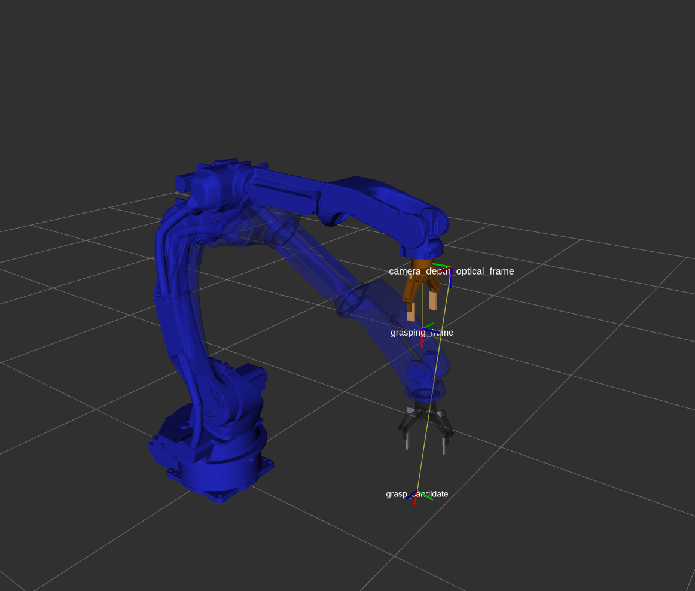

# 安川MA2010机械臂 + Robotiq 2F-140夹爪视觉抓取 (持续更新...)
**功能：在ROS平台上，使用realsense相机引导安川MA2010机械臂用Robotiq 2F-140夹爪进行抓取**

**目录**

[安川MA2010机械臂 + Robotiq 2F-140夹爪视觉抓取 (持续更新...)](#安川MA2010机械臂-+-Robotiq-2F-140夹爪视觉抓取-(持续更新...))

- [环境](#环境)
- [安装](#安装)
  - [前置条件](#前置条件)
  - [安川机械臂驱动和夹爪驱动](#安川机械臂驱动和夹爪驱动)
  - [安装本仓库](#安装本仓库)
- [安川驱动测试](#安川驱动测试)
  - [官方的功能包测试](#官方的功能包测试)
  - [用带有robotiq夹爪的机械臂测试](#用带有robotiq夹爪的机械臂测试)
- [Robotiq夹爪功能测试](#Robotiq夹爪功能测试)



## 环境

**Ubuntu16.04 + ROS kinetic + Python3.7**


## 安装

### 前置条件
  1. 安装[ROS](https://wiki.ros.org/kinetic/Installation/Ubuntu)
  2. 安装[realsense-ros](https://github.com/IntelRealSense/realsense-ros)


### 安川机械臂驱动和夹爪驱动
1. 安川机械臂机械臂驱动使用[ros-industrial/motoman](https://github.com/ros-industrial/motoman)，本仓库删除了一些无关的内容，仅保留ma2010_support
2. Robotiq 2F-140使用[Danfoa/robotiq_2finger_grippers](https://github.com/Danfoa/robotiq_2finger_grippers)的代码进行驱动，已集成在本仓库中。


### 安装本仓库
1. 创建工作空间
    ```bash
    mkdir -p demo_ws/src
    cd demo/src
    catkin_init_workspace
2. 将项目clone下来
   ```bash
   git clone --recursive https://github.com/ryanreadbooks/motoman_robotiq_grasping.git
3. 相关依赖的安装
    ```bash
    cd ..
    rosdep install --from-paths src --ignore-src -y -r
4. 使用catkin build编译
    ```bash
    # 由于项目使用python3,所以需要指定python3路径进行编译，向下面这样，如果你是其它路径，则替换下面三个路径
    catkin config -DPYTHON_EXECUTABLE=/home/ryan/Apps/miniconda3/bin/python -DPYTHON_INCLUDE_DIR=/home/ryan/Apps/miniconda3/include/python3.7m -DPYTHON_LIBRARY=/home/ryan/Apps/miniconda3/lib/libpython3.7m.so
    # 指定不进行安装
    catkin config --no-install 
    # 用catkin build进行编译
    catkin build -DSETUPTOOLS_DEB_LAYOUT=OFF    
    # 激活
    source devel/setup.bash
    ```


## 安川驱动测试

**确保电脑已经通过网线连接上机械臂控制柜内的网口**

* 确保电脑的ip和机械臂控制柜的ip是在同一个局域网网段内；
* 用 ping 命令确保两者连接正常。

### 官方的功能包测试
`ros-industrial/motoman`的ma2010测试按照[官方的wiki](http://wiki.ros.org/motoman_driver/Tutorials/Usage)进行。需要先将`robot_description`和`controller_joint_names`载入参数服务器（[官方的wiki](http://wiki.ros.org/motoman_driver/Tutorials/Usage)中的2.1 Joint Naming），然后再运行`robot_interface_streaming_YYYY`节点（[官方的wiki](http://wiki.ros.org/motoman_driver/Tutorials/Usage)中的 2 Usage）。用官方的提供的功能包 `motoman_ma2010_moveit_config` 是不带夹爪的。

> 注意：可以通过手动调用机械臂的使能（有一个/robot_enable的服务）来判断是否连通，同时可以查看关节状态（joint_states）判断是否ROS已经连接上机械臂。


```bash
rosservice call /robot_enable   # 手动使能
rostopic echo joint_states      # 查看关节角是否有数据
```


### 用带有robotiq夹爪的机械臂测试

使用 __robot_ip__ 参数运行下面的launch文件，该文件会调起所有所需的节点。`robot_ip`根据机器人设置的实际ip填写。

```bash
roslaunch ma2010_robotiq_moveit_config moveit_planning_execution.launch robot_ip:=192.168.255.1
```

启动后，会出现rviz窗口，可以在rviz中用鼠标规划机械臂的运动。

> 注意：规划完并且点击execute前，确保机械臂已经开启使能，可以通过调用服务 rosservice call /robot_enable 完成使能的开启。


## Robotiq夹爪功能测试

1. 启动夹爪控制服务节点

   ```bash
   roslaunch gripper_server bringup_gripper_server.launch
   ```

2. 通过`rosservice call` 命令调用服务`/ryan/node_gripper_service`，指定请求码等参数

   ```bash
   rosservice call /ryan/node_gripper_service "{reqcode: 200, position: 0.10, speed: 0.5, force: 1.0, comment: ''}"
   ```

**reqcode说明**：

```python
ReqGripperManualAction      = 200       # 手动动作，指定宽度、速度、力
ReqGripperOpen              = 201       # 简单一个open动作
ReqGripperClose             = 202       # 简单一个close动作
ReqGripperStop              = 203       # 夹爪停止
ReqGripperERelease          = 204       # 紧急释放夹爪
ReqGripperDebug             = 210       # 调试功能
```


